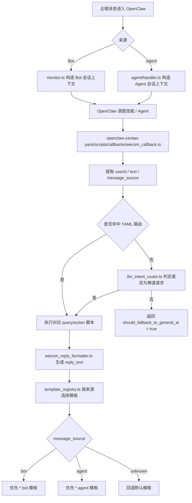

# 企业微信回调与回复链路说明

更新时间：2026-04-08

本文说明当前 OpenClaw 中企业微信消息的进入方式、来源识别、禅道回调脚本处理逻辑，以及 Bot / 自建应用两条回复链路的差异。

## 1. 当前入口分为两类

### 1.1 企微机器人 Bot 入口

- 入口代码：`openclaw-server-config/extensions/wecom/src/monitor.ts`
- 上游载荷形态：JSON
- 典型字段：
  - `msgtype`
  - `userid` / `userId`
  - `response_url`
  - `from.userid`
  - `chatid`
- 会话上下文特征：
  - `To = wecom:${chatId}`
  - `Surface = wecom`
  - `OriginatingTo = wecom:${chatId}`

Bot 模式的关键点：

- 群聊与单聊都可能从这里进入
- 回复优先走 Bot 原会话交付
- 依赖 `response_url` 做流式刷新、占位回复和最终收口
- 当群内无法直接交付某些内容时，可能切换到 Agent 私信兜底

### 1.2 企微自建应用 Agent 入口

- 入口代码：`openclaw-server-config/extensions/wecom/src/agent/handler.ts`
- 上游载荷形态：XML 解密后扁平化对象
- 典型字段：
  - `MsgType`
  - `FromUserName`
  - `ToUserName`
  - `AgentID`
  - `ChatId`
- 会话上下文特征：
  - `To = wecom-agent:${fromUser}`
  - `Surface = webchat`
  - `OriginatingTo = wecom-agent:${fromUser}`

Agent 模式的关键点：

- 回复目标默认锁定为触发者私信
- 会显式带 `wecom-agent:` 前缀，避免误走 Bot WebSocket 出站链路
- `/new`、`/reset` 等命令回执允许在 Agent 会话内继续返回

## 2. OpenClaw 内部如何区分消息来源

当前不是靠“人工配置一个 source 字段”来分，而是通过回调载荷结构判断。

识别代码：

- `openclaw-zentao-pack/scripts/shared/wecom_payload.ts`
- 方法：`detectWecomMessageSource(payload)`

当前规则：

- 命中 Bot 特征时，来源判定为 `bot`
  - 如存在 `msgtype`
  - 或存在 `userid` / `userId`
  - 或存在 `response_url`
  - 或 `sender.userid`
- 命中 Agent 特征时，来源判定为 `agent`
  - 如存在 `MsgType`
  - 或存在 `FromUserName`
  - 或存在 `ToUserName`
  - 或存在 `AgentID`
- 否则判定为 `unknown`

这一步是后续“不同来源走不同回复模板”的基础。

## 3. 禅道回调脚本当前处理顺序

统一入口：

- `openclaw-zentao-pack/scripts/callbacks/wecom_callback.ts`

处理顺序如下：

1. 读取 payload
2. 识别 `userid`
3. 提取文本内容
4. 识别消息来源 `message_source`
5. 优先处理通讯录同步类回调
6. 判断是否为“附件导入任务”特殊请求
7. 读取 `agents/modules/intent-routing.yaml` 做高优先级意图匹配
8. 若 YAML 未命中，则调用 `llm_intent_router.ts` 做禅道意图兜底判定
9. 命中后执行对应 `query-*` / `action-*` 脚本
10. 根据脚本结果和模板规则生成 `reply_text`
11. 返回结构化 JSON 给上游回复链路

## 4. 回复模板现在怎么分流

### 4.1 模板选择入口

- `openclaw-zentao-pack/scripts/callbacks/wecom_reply_formatter.ts`
- `openclaw-zentao-pack/scripts/replies/template_registry.ts`

### 4.2 当前分流规则

当路由配置里写：

```yaml
reply_template: query-my-tasks
```

系统现在会按下面顺序找模板：

1. `query-my-tasks.bot` 或 `query-my-tasks.agent`
2. `query-my-tasks`
3. `generic-fallback`

也就是说，路由配置不需要改，模板注册表会优先按来源追加后缀查找。

### 4.3 当前已接入的来源模板示例

- `scripts/replies/templates/query-my-tasks.bot.ts`
- `scripts/replies/templates/query-my-tasks.agent.ts`

这两个文件分别用于：

- 企微机器人会话文案
- 企微自建应用会话文案

后续如果还有别的意图需要分流，只要按同样命名规则新增：

- `<template>.bot.ts`
- `<template>.agent.ts`

即可。

## 5. 当前消息回复总链路



## 6. 当前各层职责边界

### 6.1 OpenClaw WeCom 插件层

负责：

- 接收企微回调
- 校验签名、解密、去重
- 构造会话上下文
- 决定 Bot 原会话回复还是 Agent 私信回复

不负责：

- 禅道意图判断细节
- 禅道模板文案
- 禅道脚本参数规则

### 6.2 `wecom_callback.ts` 编排层

负责：

- 从 payload 中抽取统一字段
- 判断 `message_source`
- 做 YAML / LLM 路由
- 执行禅道脚本
- 汇总脚本结果

不负责：

- OpenClaw 会话路由
- 企业微信签名校验
- Bot / Agent 底层发消息 API

### 6.3 模板层

负责：

- 生成面向用户的最终回复文案
- 按来源输出不同模板

不负责：

- 意图识别
- 数据查询
- 权限判断

## 7. 后续维护建议

- 新增禅道能力时，优先改 `intent-routing.yaml` 和脚本，不要继续在 `wecom_callback.ts` 里堆业务特判
- 新增来源差异文案时，优先新增 `<template>.bot.ts` / `<template>.agent.ts`
- 如果未来需要更细粒度来源，可扩展 `message_source`
  - 例如 `bot_group`
  - `bot_dm`
  - `agent_dm`
- 只有当 Bot 和 Agent 在同一意图下输出结构真的不同，才拆分来源模板；否则保持共用模板，避免文案分叉失控
