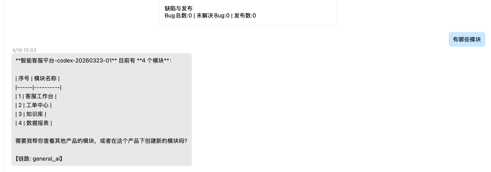

# 测试问题 SOP 清单

这个文件用于在本地记录测试、联调、回归过程中发现的问题，便于后续追踪、复盘和回填禅道。

提示词专用文档：

- `docs/ops/sop问题记录/SOP问题记录提示词.md`

## 使用规则

- 用户已经明确描述现场问题时，先记录问题，不默认要求代理重新执行或复现。
- 命令执行失败时，可以使用自动记录命令，让失败信息直接追加到本文件。
- 命令执行成功但结果不符合预期，或问题发生在真实使用场景中时，使用手工记录命令补记。
- 每条问题至少补齐：现象、期望、实际、初步判断、下一步动作。
- 需要保留现场证据时，可以附截图；建议把截图放到 `docs/ops/sop问题记录/screenshots/` 下再记录，并为每张图补一句“这张图是什么”。
- 如果只有聊天里上传的图片、没有本地路径，也要把看图后的“图片说明”写入问题记录。
- 新问题默认追加在“问题记录”顶部，方便先看最新问题。

## 推荐命令

- 截图先归档到标准目录：`npm run archive-sop-screenshot -- --source ~/Desktop/wecom-module.png --name wecom-module-general-ai`
- 现场问题直接记录：`npm run log-test-issue -- --title "企微消息未生成卡片记录" --expected "发送企微消息后自动生成卡片记录" --actual "消息已发送，但系统没有生成卡片记录" --analysis "可能是企微回调未命中卡片落盘链路" --next-action "检查企微回调日志、卡片生成逻辑和落盘条件" --tags "企微,卡片,现场问题"`
- 带截图记录：`npm run log-observed-issue -- --title "企微消息未生成卡片记录" --expected "发送企微消息后自动生成卡片记录" --actual "消息已发送，但系统没有生成卡片记录" --analysis "可能是企微回调未命中卡片落盘链路" --next-action "检查企微回调日志、卡片生成逻辑和落盘条件" --screenshots "企微聊天窗口未出现卡片::docs/ops/sop问题记录/screenshots/wecom-card-missing.png,调试台显示走了general_ai::docs/ops/sop问题记录/screenshots/wecom-router-debug.png"`
- 只有图片说明也可记录：`npm run log-observed-issue -- --title "企微消息未生成卡片记录" --expected "发送企微消息后自动生成卡片记录" --actual "消息已发送，但系统没有生成卡片记录" --analysis "可能是企微回调未命中卡片落盘链路" --next-action "检查企微回调日志、卡片生成逻辑和落盘条件" --image-notes "图1显示企微会话里返回普通文本，没有卡片|图2显示调试链路命中 general_ai"`
- 自动记录：`npm run test-with-sop-log -- --title "联调企微回调失败" --cmd "npm run wecom-callback -- --data-file examples/callbacks/tmp-callback-task.json"`
- 手工记录：`npm run log-test-issue -- --title "测试单状态未更新" --actual "接口返回成功但页面仍显示进行中" --command "npm run update-testtask-status -- --testtask 1 --status done"`

## 问题记录

### 2026-04-16 16:53 CST | 企微中发送‘有哪些模块’未走禅道卡片链路而误分流到 general_ai
- 状态：待处理
- 记录来源：手工记录
- 分类：测试异常
- 期望结果：在已有产品上下文的前提下，用户发送‘有哪些模块’后，应命中 query-product-modules 禅道路由，并以企微 Agent 卡片形式返回产品模块列表，而不是走通用问答文本回复。
- 实际结果：用户在企微中发送‘有哪些模块’后，页面展示为普通文本回复，内容是产品‘智能客服平台-codex-20260323-01’的 4 个模块 Markdown 表格，消息底部明确显示【链路: general_ai】，未走卡片链路。
- 初步判断：本次问题不是卡片模板缺失，也不是卡片发送失败，而是在进入禅道路由前被短输入 bypass 逻辑提前分流到 general_ai。query-product-modules 的 Agent 卡片模板已存在，基于当前产品上下文查询模块的语义路由能力也已存在；但主流程会先执行 shouldBypassZentaoLlm，对‘有哪些模块’这类短句进行开放问答判断。由于业务关键词白名单中未覆盖‘模块’，而开放问句提示词包含‘哪’，导致该句被误判为非禅道业务短问句，直接返回 should_fallback_to_general_ai=true，后续语义路由与 YAML 路由都未执行。另外，intent-routing.yaml 中 query-product-modules 的显式 triggers 仅包含‘查模块’‘产品模块’‘看模块’‘模块列表’，没有‘有哪些模块’，因此该表述也无法直接命中显式触发词。
- 下一步动作：后续修复建议先从路由前置分流规则收敛入手，避免‘有哪些模块’这类明显禅道业务短句被 short_input_bypass 提前分流；同时补齐 query-product-modules 对‘有哪些模块’等自然表达的触发覆盖。修复后需验证已有产品上下文下，该句能够命中 query-product-modules，并通过企微 Agent template_card 正常返回模块列表卡片。
- 跟进人：待分配
- 发生目录：`/Users/xikng/Documents/code/Zendao/openclaw-zentao-pack`
- 标签：`待修复`、`问题归档`、`现场问题`

- 图片说明：
  - 图1（企微会话截图：用户发送‘有哪些模块’后收到普通文本回复且底部显示【链路: general_ai】）：企微会话截图：这张图看到右侧用户发送‘有哪些模块’，左侧系统返回普通文本消息而不是卡片，文本中展示产品‘智能客服平台-codex-20260323-01’当前有 4 个模块，分别是‘客服工作台’、‘工单中心’、‘知识库’、‘数据报表’，消息底部带有【链路: general_ai】；这张图支持的判断是本次回复实际走了通用问答链路而不是禅道卡片链路。

- 现场截图：
  - 企微会话截图：用户发送‘有哪些模块’后收到普通文本回复且底部显示【链路: general_ai】：`./screenshots/2026-04-16/img.png`

