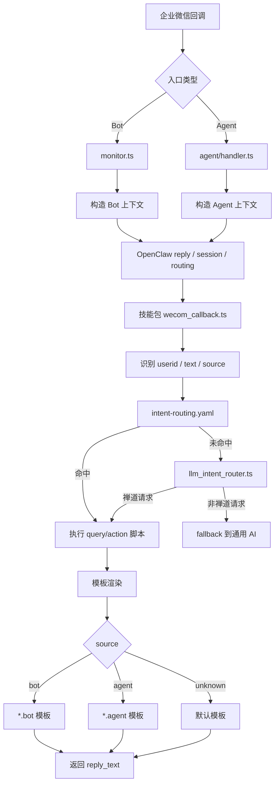

# 企微到禅道的当前运行时链路

更新时间：2026-04-08

本文从运行时视角说明当前消息是如何从企业微信进入 OpenClaw，再落到禅道查询/操作脚本，并最终回复给用户的。

## 1. 全链路概览



## 2. Bot 运行时链路

入口文件：

- `openclaw-server-config/extensions/wecom/src/monitor.ts`

处理过程：

1. 接收企业微信机器人回调
2. 校验签名、解析 JSON
3. 做消息去重和 debounce 聚合
4. 构造 OpenClaw inbound context
5. 将消息交给 OpenClaw 会话与回复调度系统
6. 如命中禅道能力，进入 `openclaw-zentao-pack`
7. 最终优先通过 Bot 原会话回复

Bot 路径的重要特征：

- 可能是群聊，也可能是单聊
- 上游常带 `response_url`
- 流式输出、占位回复、结束收口都依赖 Bot 流
- 遇到文件、超时、权限或群发限制时，可能切到 Agent 私信兜底

## 3. Agent 运行时链路

入口文件：

- `openclaw-server-config/extensions/wecom/src/agent/handler.ts`

处理过程：

1. 接收企业微信自建应用回调
2. 校验签名、解密 XML
3. 转成统一的消息对象
4. 构造 OpenClaw inbound context
5. 将回复目标锁定为 `wecom-agent:${fromUser}`
6. 进入 OpenClaw 会话与技能分发
7. 最终通过 Agent API 私信回复触发者

Agent 路径的重要特征：

- 默认面向触发者私信交付
- 不依赖 Bot `response_url`
- 通过 `wecom-agent:` 前缀避免与 Bot 出站路径混用

## 4. 技能包内的统一编排链路

统一入口：

- `openclaw-zentao-pack/scripts/callbacks/wecom_callback.ts`

统一抽取能力：

- `userid`
- `text`
- `message_source`
- `attachment`

统一处理顺序：

1. 通讯录同步回调优先处理
2. 附件导入任务特殊分支优先处理
3. 读取 `intent-routing.yaml` 匹配稳定意图
4. 未命中时调用 `llm_intent_router.ts`
5. 执行目标脚本
6. 使用模板生成 `reply_text`
7. 输出结构化 JSON

## 5. 来源识别当前怎么做

来源识别文件：

- `openclaw-zentao-pack/scripts/shared/wecom_payload.ts`

识别方法：

- `detectWecomMessageSource(payload)`

判定规则：

- Bot 载荷特征：
  - `msgtype`
  - `userid` / `userId`
  - `response_url`
  - `sender.userid`
- Agent 载荷特征：
  - `MsgType`
  - `FromUserName`
  - `ToUserName`
  - `AgentID`

输出值：

- `bot`
- `agent`
- `unknown`

## 6. 模板渲染链路

相关文件：

- `scripts/callbacks/wecom_reply_formatter.ts`
- `scripts/replies/template_registry.ts`
- `scripts/replies/templates/`

当前模板选择规则：

如果路由声明：

```yaml
reply_template: query-my-tasks
```

则按以下顺序选择：

1. `query-my-tasks.bot` 或 `query-my-tasks.agent`
2. `query-my-tasks`
3. `generic-fallback`

这样做的目的：

- 不修改旧路由配置
- 能平滑支持来源差异化文案
- 未拆来源模板的意图仍可继续使用原模板

## 7. 当前已经明确的回复分工

### 7.1 Bot 会话

适合：

- 群聊即时反馈
- 原会话连续追问
- 流式占位与“处理中”提示

限制：

- 某些内容不适合或无法直接在群内交付
- 可能存在会话权限、文件发送、6 分钟窗口等约束

### 7.2 Agent 会话

适合：

- 私信持续交互
- 命令回执
- Bot 不便承载的文件或兜底内容

限制：

- 天然不是群内原地回复
- 用户感知上更像“应用私信”而不是“机器人群消息”

## 8. 对排查问题最有用的观察点

如果要判断“为什么走了这个模板 / 为什么回到了私信 / 为什么没在群里回”，优先看：

1. 入口是不是 `monitor.ts` 还是 `agent/handler.ts`
2. 构造出来的 `To` / `OriginatingTo` 是不是 `wecom-agent:`
3. `wecom_callback.ts` 识别出的 `message_source` 是什么
4. 当前路由命中的 `reply_template` 是什么
5. 模板注册表里有没有 `<template>.bot` 或 `<template>.agent`

## 9. 当前结论

当前链路已经具备以下能力：

- 能区分企微机器人与企微自建应用两种来源
- 能把来源一路透传到禅道回调模板层
- 能在不修改旧路由配置的前提下做来源模板分流

当前仍需注意：

- 模板分流机制已经就位，但只对已拆分出 `.bot` / `.agent` 模板的意图生效
- 还没有拆分模板的意图，仍会共用原模板
